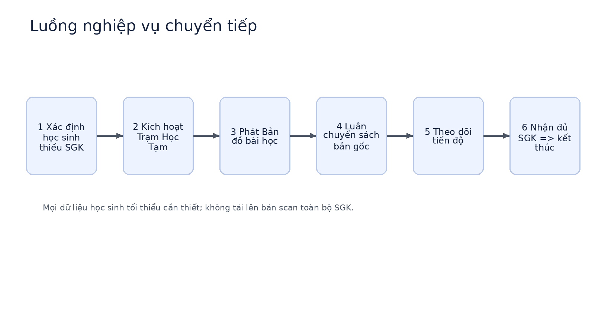

# Trạm Học Tạm

> Giải pháp **chuyển tiếp** giúp học sinh học liên tục khi sách giáo khoa chưa được cung ứng đầy đủ — **không photocopy SGK**, tuân thủ bản quyền, chi phí thấp, triển khai nhanh.

## Bài toán

Khi thống nhất và điều chỉnh hệ thống sách giáo khoa, nguồn cung có thể chưa kịp ở một số địa phương và trường học, khiến một bộ phận học sinh thiếu tài liệu trong những tuần đầu năm học. Photocopy cả cuốn là cách làm quen thuộc nhưng việc sao chép và phát hành tài liệu có bản quyền khi chưa được phép có thể phát sinh vấn đề pháp lý.

## Giải pháp

Mỗi lớp thiếu sách được mở một **“Trạm Học Tạm”** có thời hạn, gồm bốn thành phần:

1. **Bản đồ bài học** — học liệu ngắn theo tuần do giáo viên tự biên soạn (mục tiêu, từ khóa, ví dụ riêng, checklist, quiz). Không chép lại nguyên văn SGK.
2. **Tủ sách bản gốc luân chuyển** — dùng số bản sách trường/thư viện đang có, mượn theo ca ngắn hoặc dùng chung theo nhóm.
3. **Cổng kiểm duyệt bản quyền** — mọi tài liệu cần có nguồn, trạng thái XANH / VÀNG / ĐỎ và người chịu trách nhiệm trước khi publish.
4. **Tự đóng khi đủ sách** — có hạn hiệu lực, nút đóng Trạm và nhật ký hoạt động.



Có phương án giấy: học sinh có thể học bằng **phiếu bài học in A4** (nút “In phiếu bài học” ở Góc học sinh), không cần Internet cá nhân.

Trang **/solution** trong web đối chiếu giải pháp với từng yêu cầu của đề bài.

## Tính năng

| Trang | Nội dung |
| --- | --- |
| `/` Tổng quan | Trạng thái Trạm, số liệu, tiến độ tuần, hoạt động gần đây |
| `/solution` Giải pháp | Ý tưởng, quy trình, đối chiếu với đề bài, căn cứ tham khảo |
| `/student` Góc học sinh | Chọn bài, checklist, tiến độ, quiz, in phiếu bài học |
| `/library` Tủ sách | Tìm kiếm, lọc theo môn, mượn/trả, số bản còn lại |
| `/teacher` Góc giáo viên | Tạo & publish bài học, theo dõi học sinh, xuất CSV, đóng/mở Trạm, audit log |
| `/copyright` Bản quyền | Hàng đợi kiểm duyệt XANH/VÀNG/ĐỎ, duyệt/chặn, gửi tài liệu mới |

Đây là **prototype chạy phía trình duyệt**: dữ liệu lớp, học sinh, sách đều là **dữ liệu mẫu giả lập**, lưu trong `localStorage`. Có nút “Đặt lại dữ liệu demo” ở thanh bên.

## Chạy trên máy

Yêu cầu: **Node.js ≥ 20.9** (khuyến nghị 22, xem `.nvmrc`).

```bash
npm install
npm run dev        # http://localhost:3000
```

Build bản production:

```bash
npm run build
npm start
```

Không cần biến môi trường, database hay kết nối Internet khi chạy (font dùng font hệ thống nên không tải gì từ bên ngoài). File `.env.example` chỉ dành cho hướng phát triển production.

## Đưa lên GitHub

Chạy `npm install` một lần để tạo `package-lock.json` rồi commit cùng mã nguồn:

```bash
git init
git add .
git commit -m "Trạm Học Tạm MVP"
git branch -M main
git remote add origin https://github.com/<tai-khoan>/tram-hoc-tam.git
git push -u origin main
```

Repo có sẵn workflow `.github/workflows/ci.yml` tự chạy `npm run build` (kèm kiểm tra TypeScript) mỗi lần push.

## Triển khai web (tùy chọn)

Import repo vào [Vercel](https://vercel.com) và bấm Deploy — Next.js chạy không cần cấu hình thêm.

## Cấu trúc thư mục

```
app/            Các trang (App Router): /, /solution, /student, /library, /teacher, /copyright
components/     Shell (khung + menu), AppProvider (trạng thái + localStorage), UI, icon
lib/data.ts     Kiểu dữ liệu và dữ liệu mẫu
docs/           Kiến trúc, lưu ý pháp lý, tài liệu mô tả dự án (PDF)
tests/          Checklist nghiệm thu
prisma/         Lược đồ cơ sở dữ liệu tham khảo cho bản production (chưa dùng trong demo)
assets/         Hình minh họa
```

## Bản quyền và pháp lý

- Hệ thống **không lưu, không phát tán bản scan toàn bộ SGK**.
- Chỉ dùng học liệu tự biên soạn, tài nguyên có giấy phép, hoặc liên kết tới nguồn chính thức.
- Sách bản gốc chỉ **mượn – trả**, không sao chép.
- Xem `docs/legal-safeguards.md`. Đây là checklist thiết kế, **không phải tư vấn pháp lý**; nhà trường cần kiểm tra văn bản còn hiệu lực trước khi triển khai.

## Hạn chế và hướng phát triển

Bản demo chưa có đăng nhập, cơ sở dữ liệu hay phân quyền thật. Để dùng thực tế cần: Auth.js/SSO trường học, PostgreSQL + Prisma, API/server actions, lưu trữ học liệu tự tạo, phân quyền theo vai trò, audit log phía máy chủ, phê duyệt nhiều cấp, kết nối LMS/kho tài nguyên chính thức.

## Giấy phép

Xem file `LICENSE`.
