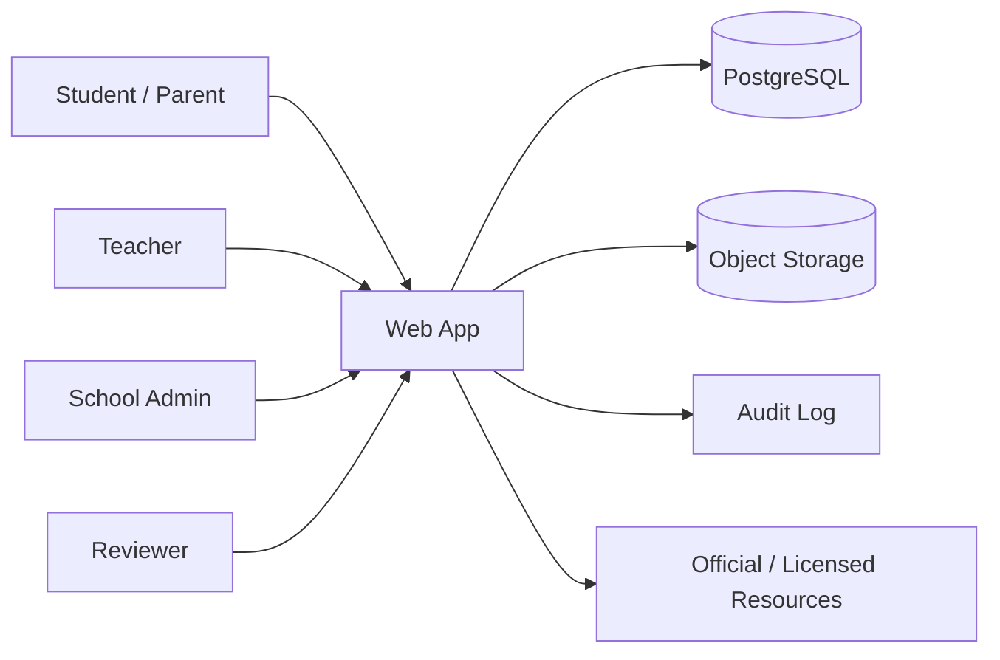

# Architecture

```mermaid
flowchart LR
  U[Student / Parent] --> W[Web App]
  T[Teacher] --> W
  A[School Admin] --> W
  R[Reviewer] --> W
  W --> DB[(PostgreSQL)]
  W --> S[(Object Storage)]
  W --> L[Audit Log]
  W --> O[Official / Licensed Resources]
```

## Main modules
- Auth / roles
- Classes / students
- Lessons
- Resource review
- Book circulation
- Transition sessions
- Audit
